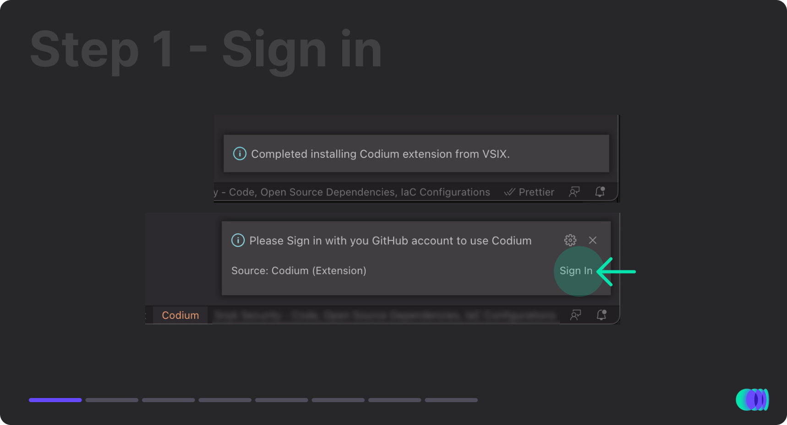
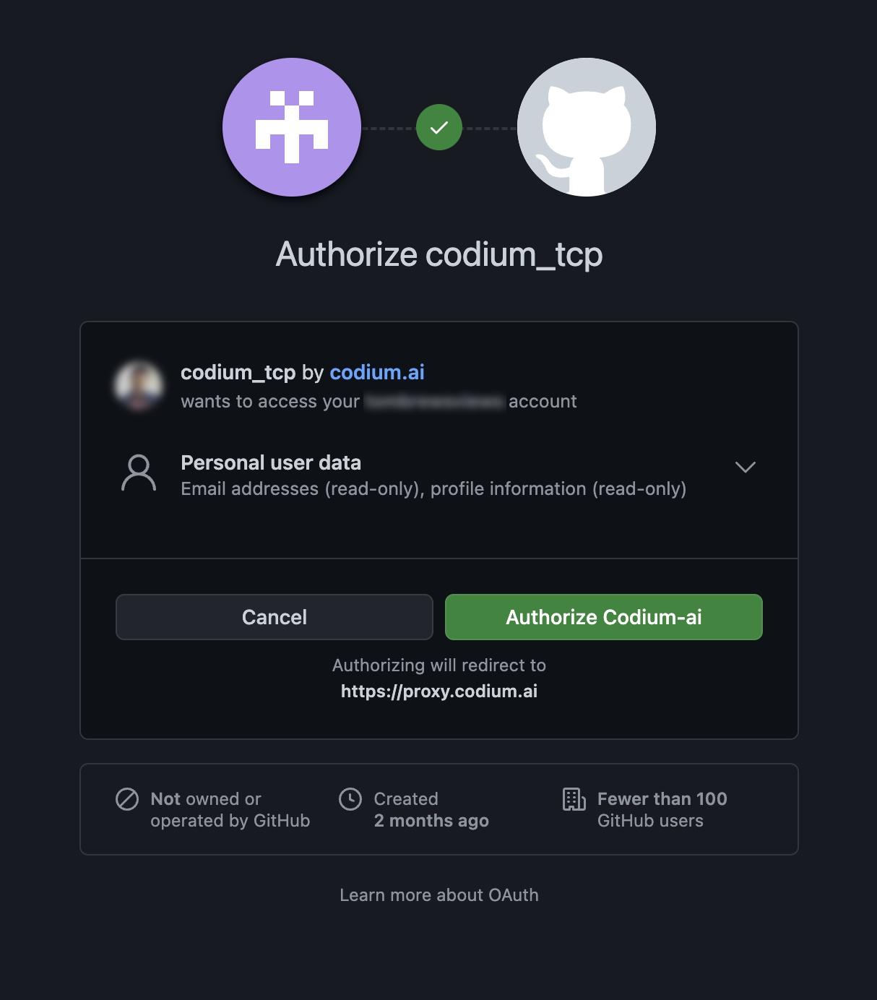
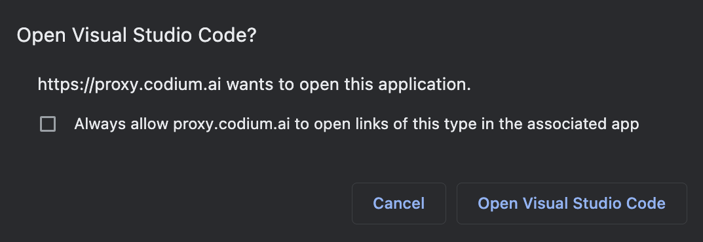
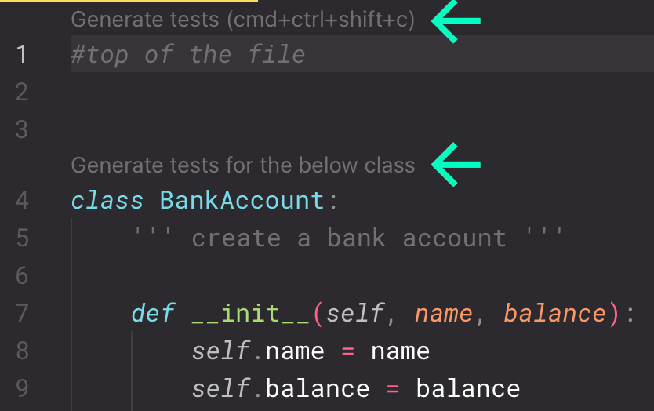

# Code fast with CodiumAI

---

> CodiumAI analyzes your Python code and generates meaningful tests to catch bugs before you ship. With Codium, you can easily and quickly create comprehensive test suites that help you ensure the reliability and correctness of your software.

---

_Closed Alpha Version 0.0.13_

## Features

#### 🤖 Generates unit tests automatically

Simply press the "generate tests" button above your Python class or function, and CodiumAI will generate a set of suggested tests for different use cases.

#### ✨ Works seamlessly with VSCode

The generated tests will be displayed in a new tab in your VSCode IDE, along with your code description, so you can easily review and edit them as needed.

#### 🚀 Helps you improve code quality

By creating comprehensive test suites, our tool helps you catch and fix bugs early, and ensures that your code is reliable and maintainable.

---

## Installing / Getting started

1. Open extensions manager (Shift+CMD+X on Mac, Shift+CTRL+X on Windows), go to more actions elypsis button in the top right corner of the extensions panel, and select Install from VSIX.

2. Navigate and select the codium-0.0.13.vsix file.

3. You should now receive a successful installation and sign in notification on the bottom of the VSCode editor. Click "Sign in" button in the notification popup to activate Codium with your Github account.

> If you can't see the notification on the bottom right of the editor window, click the button labeled Codium in the bottom status bar.

4. You will be redirected to the Github login page and once you confirm the activation you should be redirected back to the editor. Status notification should show your Github username when the activation was successful.

 
_You can now close the browser tab_

5. Write Python a class or function in a new file.
6. Press the "Generate Tests" on top of the function or use the shortcut SHIFT+CMD+CTRL+C on Mac or ALT+CTRL+SHIFT+C on Windows.

7. A new tab will open in your VSCode IDE with the generated tests, along with your code description and test strategies description.
8. Review and edit the tests and code description to improve the quality of the next tests generation (coming soon).
9. Press "regenerate tests" and let the machine learning to refine your tests, based on your changes (coming soon).
10. Save the tests when CodiumAI covered all the use cases.

> Tip: You can switch on and off the Generate Tests button by adding this setting to your configuration file `"editor.codeLens": false/true,`

## How to uninstall

1. Select "Codium" button in the bottom status bar.
2. Hover over the authentication notification, select the settings icon and "Manage Extension" option from the dropdown.

3. Codium Extension will open in a new tab. Select Unistall and Reload VSCode.

## Links

- Project homepage: https://codium.ai
- BLog: https://www.codium.ai/blog

## Licensing

- Terms of use: https://www.codium.ai/terms-of-use
- Privacy policy: https://www.codium.ai/platform-privacy-policy

Please notice - Like other popular tools (such as copilot), we also send code snippets to our servers.
